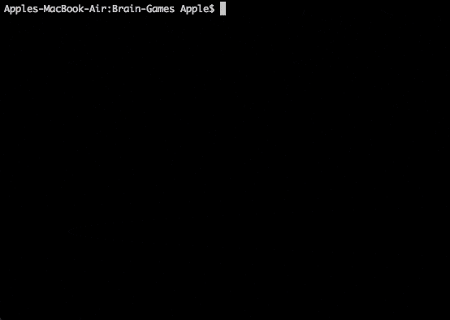
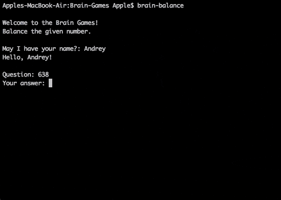

# brain-games-s320

[](https://codeclimate.com/github/andrey-pryadko/project-lvl1-s320/maintainability)
[](https://travis-ci.org/andrey-pryadko/project-lvl1-s320)
#

## Brain Games. [Hexlet](https://hexlet.io) study project.
My first Back-end JavaScript project. There are 6 small console games. Enjoy;)
#

### Installation

```sh
$ npm install -g bain-games-s320
```
### Choose the game:

1. Calculator. (#calculator)
2. Is even? (#is even)
3. Is prime? (#is prime)
4. Greater common divisor. (#greater)
5. Balance the number. (#balance)
6. Arithmetic progression. (#arithmetic)

#

### 1. Calculator.

description

Run

```sh
$ brain-calc
```


### 2. Is even?

description

Run

```sh
$ brain-even
```


### 3. Is prime?

description

Run

```sh
$ brain-prime
```




### 4. Greater common divisor.

description

Run

```sh
$ brain-gcd
```


### 5. Balance.

description

Run

```sh
$ brain-balance
```




### 6. Arithmetic progression.

description

Run

```sh
$ brain-progression
```

